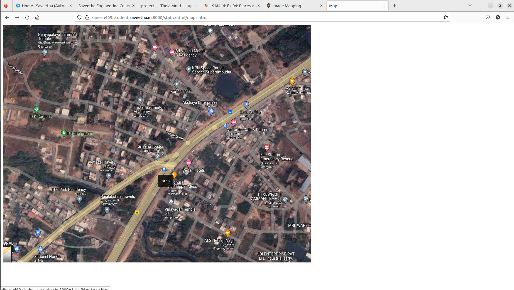
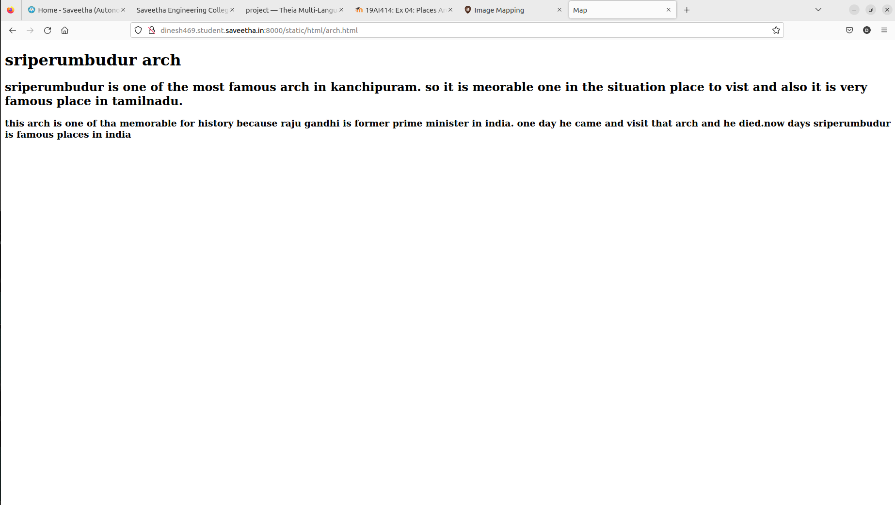

# Places Around Me
## AIM:
To develop a website to display details about the places around my house.

## Design Steps:

### Step 1:
create a new folder and clone the git repository
### Step 2:
create a new project using command"django-admin startproject myproj"and include the necessary details in setting.py.
### step3 :
create a new folder"satic"in myproj .in staic,create new folder"html".in.html,create new file"map.html".
### step4 :
upload your screenshot in image-maps.com of your locality taken from googlemaps.and select the places you want to show the details
### step5 :
get the code and paste it in your html files.create necessary html pages and attach them in main html file
### step6 :
execute the program 
## Code:
maps.html
```
<!DOCTYPE html>
<html lang="">
    <head><title>Map</title>
        <meta charset="UTF-8">
    </head>
    <body>
        
        <map name="image-maps-2023-01-19-073848" id="ImageMapsCom-image-maps-2023-01-19-073848">
        <area  alt="" title="throwpathy temple" href="throwpathytemple.html" shape="rect" coords="1008,635,1058,685" style="outline:none;" target="_self"     />
        <area  alt="" title="arch" href="arch.html" shape="rect" coords="549,476,599,526" style="outline:none;" target="_self"     />
        <area  alt="" title="temple" href="temple.html" shape="rect" coords="615,650,665,700" style="outline:none;" target="_self"     />
        <area  alt="" title="fire station" href="fire.html" shape="rect" coords="947,452,997,502" style="outline:none;" target="_self"     />
        <area  alt="" title="park" href="park.html" shape="rect" coords="278,634,328,684" style="outline:none;" target="_self"     />
        <area shape="rect" coords="1105,850,1107,852" alt="Image Map" style="outline:none;" title="Image Map" href="https://www.image-maps.com/" />
        </map>
   </body>
</html>
```

arch.html
```
<!DOCTYPE html>
<html lang="">
    <head><title>Map</title>
        <meta charset="UTF-8">
        <h1>sriperumbudur arch</h1>
        <h2> sriperumbudur is one of the most famous arch in kanchipuram. so it is meorable one in the situation place to vist and also it is very famous place in tamilnadu.</h2>
        <h3>
            this arch is one of tha memorable for history because raju gandhi is former prime minister in india. one day he came and visit that arch and he died.now days sriperumbudur is famous places in india 
        </h3>
    </head>
    <body>
```

throwpathptemple.html
```
<!DOCTYPE html>
<html lang="">
    <head><title>Map</title>
        <meta charset="UTF-8">
        <h1>throwpathytemple</h1>
        <h2>
            throwpathytemple is one of the famous and most important place in kanchipuram and many king came and meet the temple after won the war
        </h2>
        <h3>
            this temple is one of old place in undia because this has been built in 400bce. this is ancident temple in now days.that enough for that temple
        </h3>
    </head>
    <body>
```
temple.html
```
<!DOCTYPE html>
<html lang="">
    <head><title>Map</title>
        <meta charset="UTF-8">
        <h1>temple</h1>
        <h2>
            ganesh temple is one of the most religious temple because lord ganesh festival in that time there is most crowd in that place because sriperumbudur is one of the famous place so the lord ganesh temple is famous in that festival time
        </h2>
    </head>
    <body>
```

park.html

```
<!DOCTYPE html>
<html lang="">
    <head><title>Map</title>
        <meta charset="UTF-8">
        <h1>park</h1>
        <h2>
            park is one of the famous place because this place is tourist place in kanchipuram.on that day i went to park residency.there is lot of enjoyment in that park and water dance in park and most famous lovable couples in that park.

        </h2>
        <h3>
            sriperumbudur park is famous in that chennai,kanchipuram.this park is one of the important place for government because in this park main tourist place in tamilnadu
        </h3>
    </head>
    <body>
```
    fire.html
```
    <!DOCTYPE html>
<html lang="">
    <head><title>Map</title>
        <meta charset="UTF-8">
        <h1>fire</h1>
        <h2>
            fire service is most important in that place.because fire service is very active in that place.one time sriperumbudur fir service got award for fast service and safe srervices in whole tamilnadu
        </h2>
        <h3>
            one time one company got fire accident that day they came very fast and  they saved all people without any injury.that news is famous in tamilnadu so they got award for that purpose.
        </h3>
    </head>
    <body>
```
## Output:



## Result:
A website to display details about the places arond my house is executed successfully